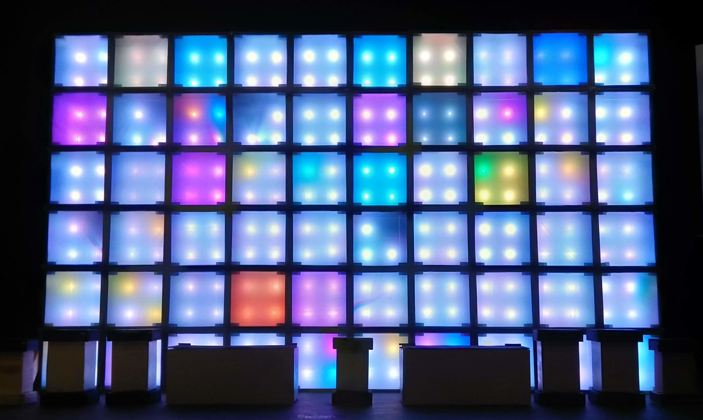
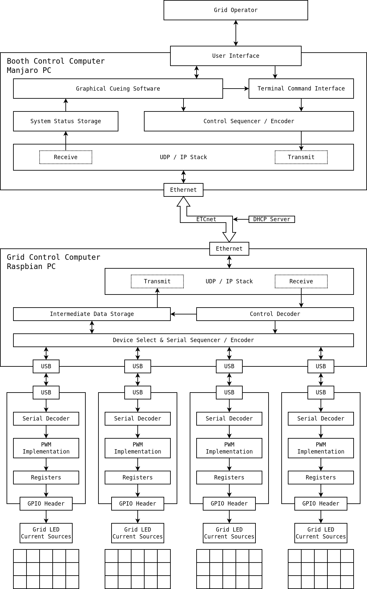
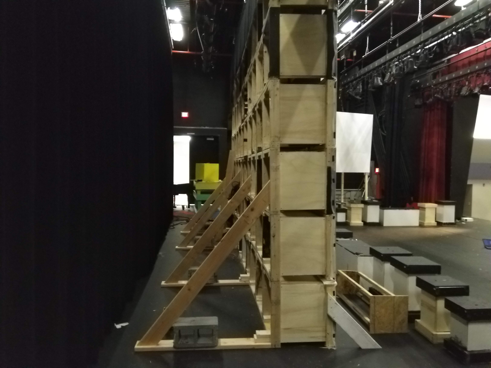
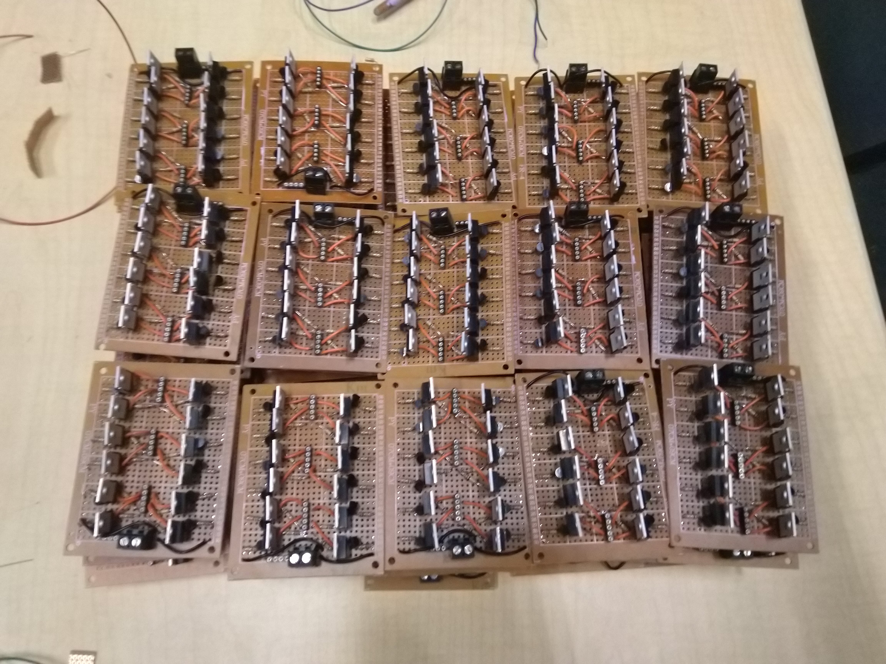
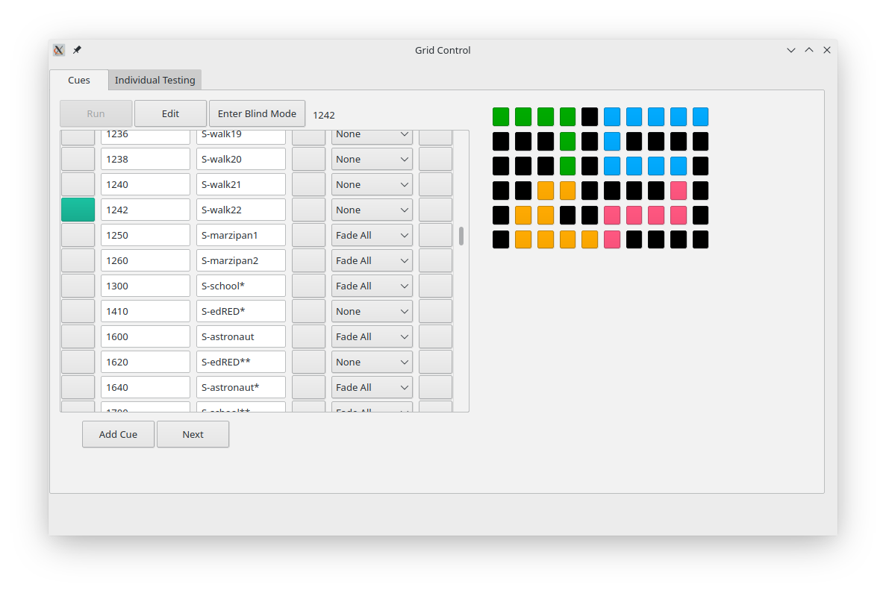
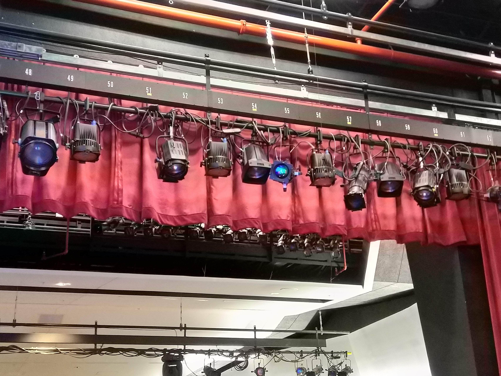

# The Grid

# Table of Contents

1.  [Under Construction](#org4e31319)
2.  [Overview](#orgddce423)
3.  [Project Goals](#org27a8e06)
    1.  [Overall](#orgf33c17d)
    2.  [Design](#org3ddfc4e)
    3.  [Implementation](#orge4cc2e5)
4.  [System](#orgab08084)
    1.  [Origins](#org15afbf3)
    2.  [Considerations](#org984049b)
    3.  [Examination](#org4223284)
        1.  [Board](#org9094cac)
        2.  [Cube](#org7cbf77a)
        3.  [Column](#org4744b31)
        4.  [Grid](#orgfe13412)
        5.  [Control](#org2ae035e)
5.  [Structure](#org9b584a7)
6.  [Electronics](#orgca242fe)
7.  [Software](#org8aeed29)
8.  [Reflection](#org893cef3)

# Under Construction

This readme file will become much more extensive in the future.

# Overview

By far my most challenging and ambitious engineering project up to its
time, the Grid was a massive lighted display board which served as a
set piece for the play in my senior year of high school. The image
above shows the first time the entire Grid lit up at once. This
display wall was composed of 60 wooden cubes, each two feet by two
feet, for a total size of twenty feet at the base by twelve feet in
height. Every cube contained four high power red-green-blue (RGB)
light emitting diodes (LED) and acted as a single pixel.

A complex system, the Grid had many aspects, ranging from
architectural design to electronics manufacturing. I was the lead
engineer for the project; I designed every element of the Grid and its
production process, and oversaw the implementation. I owned this
project from conception to completion, keeping everything on schedule
and managing a team of other students throughout the process. As well
as engineering, I also managed the acquisition of all the components
we needed, making sure the director purchased them when necessary.

The various parts of the final product may be best understood by
working backwards from our desired results. This project's goal was to
construct an impressive lighted backdrop for a theatrical performance;
we chose sixty pixels as an artistically and logistically appropriate
resolution. Each pixel was a cube: a frame constructed of 2 by 4
lumber with a mounting panel midway in, behind a sheet of diffusing
plastic on the front. Four high power LEDs occupied each cube; all
four in any cube were always the same color.

Current had to be supplied to the LEDs, as they were simply packages
with solder pads. We constructed and connected current sources by
hand, one circuit board per cube, to drive the lights. Power for all
these custom LED drivers came from ten power supplies that we wired
with fuses ourselves, also by hand. Four Arduino microcontroller
boards switched on and off the current sources, and in turn the
LEDs. I wrote custom software to enable pulse width modulation on
every pin of these boards, allowing full dimming of each pixel.

All control signals were orchestrated by a Raspberry Pi computer that
acted as a server, accepting packets of lighting data from a client
computer and sending appropriate signals to the Arduinos to adjust the
pixels' light levels. The client computer was a laptop held by the
Grid operator, running custom software that provided a full graphical
interface to the Grid. This application could edit and save lists of
cues for shows; during each show, it sent thousands of frames to the
Grid server including animations and automatically generated
transitions.

We used the Grid during performances of *The Curious Incident of the
Dog in the Night-time*; it was the centerpiece of our technically
ambitious set. Work began three months prior to the show, which was a
short timeline for such a project considering that time in the
workshop was mostly limited to weekday after school
rehearsals. Nonetheless, we finished the Grid on time and as
specified; it was used for all four performances of the production. As
all things in theater, it was transient, being disassembled shortly
after the show.

Our show was commended by critics for the technical feat. There are
awards for high school theatrical productions in northern Virginia,
the "Cappies", and the Grid would have won in a technical category had
a pandemic not abruptly truncated the school year in March 2020. At my
school, technical theater was the extracurricular activity where real
engineering happened, and this was by far the largest project ever
attempted by our school's theater department. I hazard that it will
remain unmatched.

While I led the project, I also worked with a fantastic team of other
people, without whom this project would not have been possible. We
assembled something truly great together. One particular colleague of
mine contributed more than any other to the Grid. She personally wrote
thousands of lines of code to create the Grid client software, a
crucial part of the system that would not have otherwise come to
fruition. This is only the most notable of her efforts, and I give her
full credit for the client software.

This repository's top level directory is divided into a few
folders. The directories `structure`, `electronics`, and `software`
contain resources relevant to those aspects of the project,
respectively. The `media` directory holds a curated selection of
dozens of pictures and videos which exhibit the Grid in action. The
other files in this top directory are relevant to the entire
project. In the Bill of Materials is a listing of all the components
and tools used to assemble the lighting system. There is also a
diagram of the control architecture, and my first design document for
the Grid.

# Project Goals

## Overall

-   Build a huge, visually striking set piece with dynamic lighting
    elements to serve as the backdrop for a play
-   Display a sequence of designs during the show, including static
    images and animations
-   Surprise the audience with the breadth and scale of effects that may
    be shown on the display
-   Enhance immersion in the show by making the backdrop designs, and
    the piece itself, fit a certain aesthetic
-   Learn valuable techniques for multidisciplinary engineering and
    project management
-   Teach a team of other students how to effectively manufacture
    structures and electronics

## Design

-   Devise an inexpensive architecture, aiming to fit within a
    relatively low budget for such a project
-   Make the device look clean, modern, and monolithic from the
    audience's perspective
-   Primarily use available architectural materials, mostly wood, from
    the set workshop
-   Let the design be driven by requirements, and find the appropriate
    LED chips for the job
-   Come up with a switchable, cheap, easy to assemble current supply
    design using discrete components
-   Determine how to network many electronic parts together so that each
    receives necessary power
-   Use inexpensive computers to control the light array, writing all
    necessary algorithms by hand
-   Send images to the system remotely, from another computer, so that
    the operator may be elsewhere
-   Create cue software that enables graphical design of a sequential
    list of images for the display
-   Add an interface to the cue software to display images on the light
    array during the show

## Implementation

-   Manage and work with a team of people to assemble a massive object
    with many thousands of components
-   Find all necessary tools or parts and make sure that they are
    purchased when needed
-   Oversee inventory of components and equipment, looking out for
    losses or shortages
-   Instruct inexperienced students personally in disciplines like
    soldering and wiring
-   Work extensive quality control, fixing errors in construction that
    others failed to catch
-   Test all devices with care to ensure that nothing will break when
    the design scales up
-   Write hundreds of lines of code, fully test them, and optimize the
    software however needed
-   Lead the team, make sure there are tasks for people, and keep morale
    up throughout the project
-   Come up with fixes to unexpected issues right away, avoiding delays
    as much as possible
-   Do any critical job that abruptly comes up, spending as long as
    necessary to stay on track

# System

The above diagram depicts the Grid control system. I created it during
the software design process; it includes all the aspects of the final
system, as well as some features that we did not quite have time to
develop. Physical parts of the Grid are glossed over here, but are
certainly worth exploring as part of the overall system. In this
section, I will examine the Grid's components, the interactions
between them, and how they were all integrated into a functional,
controllable display. Much of the implementation detail will be saved
for the later sections specific to each system.

## Origins

I was given the original specification for this project near the end
of the school year before the show, my junior year. Our theater
director wanted what was essentially a grid of independently
controlled, colored lights for the next year's first show. The vision
for the design went through a few iterations before the summer
began. Regardless, it is far harder to bring such a device into being
than it is to talk about it. The director would agree that at the
time, he had no idea of the complexity of the system he was asking
for.

Shortly before the summer, we had a design meeting, during which I
brainstormed and wrote up my first design document for the Grid. My
first goal was to find an inexpensive and powerful LED component, as
this would drive the design of all of the other electronics. After
finding a three color, three watt LED chip, I set to work designing
the many systems that must interface together in a fully functional
digital display. I spent many summer mornings drawing design sketches
with pencil and paper; I find that this is always the best way to work
through complex problems.

## Considerations

Certain decisions about appearance and functionality must be made to
drive the rest of an engineered system's design. We knew that the Grid
should appear extremely large, make emotional impressions without
distracting the audience, and not be too complex to build in the time
we had. The maximum height for our stage is twelve feet, and we
calculated that twenty feet of width would make the Grid appear to
fill the stage while remaining visible to the entire audience.

Both dimensions are multiples of two, so we settled on pixels sized at
two feet by two feet. This size is easy to build and manageable to
work with; it required sixty cubes, two feet to an edge. Ten by six is
quite a low resolution, but this allowed us to minimize the amount of
electronics we had to build. It also fit the artistic goals of the
show, as a backdrop with high resolution images would have distracted
viewers from the actors' performances at the front of the stage.

I determined that diffusing the light from four RGB LEDs, dissipating
three watts of power each, would deliver an appropriate effect. It was
critical that every pixel be independently and instantly controllable,
at any time, in both color and brightness. This requirement drove the
design of the entire control system towards speed and
flexibility. With the above core points in mind, the interactions of
the many components of the Grid fell into place, as they all acted in
service to our central goals.

## Examination

This section will provide an overview of the entire Grid with an eye
to system integration. I will build my way up through ever larger and
more encompassing logical divisions of the Grid system, going over the
design and implementation that must come together for each one to take
its place and function as specified. The boards are the circuit
prototyping boards on which the LED drivers were assembled. The cubes
are the individual pixels that make up the display. Each column has
its power independently distributed. The Grid itself, of course, is
the entire display wall. The control system abstracts the Grid's
technical details and allows for relatively simple operation.

### Board

Once I knew the LED part I would be using, I needed to decide how best
to distribute power to 240 of them (60 cubes with 4 LEDs each). An
LED's brightness is a function of its current; small variations in
current often cause significant fluctuations in brightness. To avoid
such unsightly variance, I needed to ensure that constant current
would pass through each LED when it was turned on. This is in fact
more complicated than it appears at first, as every red-green-blue LED
package contains three independent diodes, one of each color.

Each individual diode is rated for about 350 milliamps of sustained
current. I wanted to get the most out of these LEDs, so that is the
current I targeted with my design. I sketched out possible schemes to
provide current to all three colors in a package with a single
circuit, which would have saved components. Unfortunately, it was not
to be; it would still have been possible for one diode to heat more
than the others, draw extra current, and go into thermal runaway,
probably burning out in the end.

In the end, the design needed 720 independent current sources (240 RGB
LEDs, 3 diodes each). Every current source needed to pull 0.35 amps
through its diode at all times when switched on. Some commercial
products get close to these requirements, but it turned out to be far
cheaper in this case to purchase individual components with which to
assemble current sources ourselves. My design required two resistors
and two transistors per current source to be soldered together in a
particular manner.

Since a cube contained 12 diodes (4 LED packages), it made sense to
construct circuit boards containing 12 current source LED drivers
each. We obtained perforated prototyping boards on which twelve
circuits and supporting connectors fit perfectly. I designed the
circuit and the board layout in Kicad, made several prototypes for
testing, and taught many other students to assemble boards by placing
components and then carefully soldering them in place. This will be
discussed more later, but we soldered over 15000 connections by hand.

Along with the drivers, each board included sixteen sockets to connect
the LEDs. With a common anode design, each LED package had a single
positive voltage input for all three diodes, and an independent
cathode for each one. Four sockets on the board provided voltage to
the LED packages, and the other twelve connected to the drivers, which
would be switched to choose whether current would be allowed to flow
through each diode. Three control inputs mediated this switching, one
for each color; they accepted 5 volt logic levels.

Power for all twelve diodes, which could reach a maximum of over
twelve watts (~4.2A at ~3V), was supplied through a pair of screw
terminals soldered to the circuit board and large enough to accept
thick power supply wires. Positive voltage was connected directly to
the LED anode sockets, and ground was connected to two ground rails
that ran down both sides of the board and connected to every current
source along the way. To complete the circuit and render the board
operational, LED packages had to be properly connected to the sockets.

-   Current Sources
    -   Knowing the kind of LED I would be using, I then needed to decide
        how to distribute power to all 240 of them
    -   An LED's brightness is a function of its current, and small
        variations in current can lead to significant fluctuations
    -   For this reason, I needed to ensure that constant current would
        pass thru each LED
    -   Every red green blue light emitting diode package in fact contains
        three independent LEDs, one of each color
    -   Every individual diode is rated for ~350 milliamps of current, so
        that is what I needed to provide
    -   I considered schemes to provide current to all three colors of a
        package with one circuit, but it would still have been possible
        for one chip to heat, draw more, and go into runaway
    -   In the end, it was necessary to include 720 independent current
        sources in the design, 0.35 A each
    -   It turned out to be far, far cheaper to purchase individual
        transistors and resistors with which to assemble current sources
        ourselves, as opposed to purchasing what was available
    -   Every cube (pixel) contained 12 current sources (4 LED
        packages \* 3 colors each); all were on the same circuit board
        and cooled with a PC case fan
    -   I designed the circuit and board layout in Kicad, did several
        prototyping passes, and taught others to build boards
    -   More discussion on this later, but our current sources, something
        like 15000 connections total, were all soldered by hand

### Cube

Home to four RGB LED packages and one driver circuit board, each cube
constituted a single pixel in the Grid's display. Like all of our
theatrical sets, the structure of the Grid was constructed from
lumber, wood sheets, and screws. These materials are readily available
in a technical theater workshop. It was easy to envision each of the
Grid's pixels as an independent piece of structure that could be built
on its own before being combined into the whole. Every cube was
composed of twelve lengths of two by four lumber, each about two feet
long, joined together with about thirty construction screws.

These wooden frames created a square border around each pixel of the
Grid, which contributed to its iconic look. We routed channels at
appropriate locations in the frame to permit a sheet of plywood to be
slid into place; this was a panel on which to mount the
electronics. The sides of the cubes got additional plywood panels,
which prevented light from bleeding within the structure, keeping each
pixel distinct from every other. Areas of each cube were strategically
painted black to prevent the final Grid from looking like it was made
out of wood.

-   remember the cooling fans
    -   cubes
        -   All of our theatrical sets are constructed primarily from
            lumber, wood sheets, and screws
        -   These are the materials we had available, so these are the
            materials from which the Grid's body was built
        -   It was easy to envision each pixel of the display as an
            independent structural component: a cube
        -   Every cube was made of 12 lengths of 2x4 lumber, each about 2
            feet long, joined with construction screws
        -   The frames led to an unavoidable square border around each
            pixel, which turned out to look quite cool
        -   Channels were routed at appropriate locations in the frame to
            allow a sheet of plywood to be slid into place as a panel to
            mount electronics on
        -   Additional panels were applied to the sides of the cubes to
            prevent light from bleeding between them within the structure
        -   After LEDs were installed on the front of said panel, a sheet of
            translucent, diffusing plastic was stretched over the front of
            the cube to spread the light out and form a large square pixel
        -   As part of the process, areas of each cube were strategically
            painted black, which prevented the final Grid from looking, from
            the front, like it was made of wood
    
    -   most of this should go under Grid
        -   Sixty cubes were manufactured in total; they were taken out to
            the stage and stacked in a rectangle, 10 by 6
        -   All cubes were carefully aligned to make the front surface would
            appear as flat and seamless as possible
        -   They were all screwed together in the back on all four sides,
            making the structure extremely solid
    
    -   Integration (almost all this goes here though)
        -   Having an electronic system design is one thing, but integrating
            it into a 12 foot high wooden structure is quite another
        -   As we finished building each cube, we affixed 4 LED packages to
            the mounting panel in its middle
        -   The LEDs went on the front of the panel, and all of the other
            electronics went on the back
        -   Before placing every LED, long connecting wires had to be
            soldered to its four pads and run through a hole to the back of
            the cube
        -   Thus, the Grid structure was built out of cubes onstage with all
            LEDs already installed
        -   After every circuit board was completed and tested, it had to be
            attached to the back of a cube's mounting panel
        -   Each circuit board had sixteen sockets for the sixteen wires
            from the LEDs, which had to be carefully connected with pliers
        -   In addition to those, there were three sockets for the control
            wires from the microcontrollers, which were much, much longer
            and had to be run across the back of the Grid and secured
        -   Sixty desktop computer case fans were acquired to cool the
            transistors of the circuit boards
        -   These, too, had to be mounted to the internal structure of the
            cube and connected to the circuit board for power
        -   The circuit boards could not be powered without the power
            supplies, which were placed in the third cube from the ground in
            each column
        -   Handmade power cables connected the supply output sockets to
            screw terminals on each circuit board
        -   More custom cables ran from the power supplies to backstage
            stage pin connectors

### Column

-   Supports
    -   The Grid may have been large and sturdy, but it was narrow
        compared to its width, making it prone to tipping
    -   Since dozens of people were going to be working and acting
        around the structure for weeks, it was necessary to fix this
    -   Simply widening the base of the Grid would suffice, for which
        purpose supports needed to be added
    -   I added diagonal supports to the front first; these needed to be
        short to evade notice by the audience
    -   The front supports only extended by about a foot, but this was
        enough to prevent tipping in that direction, especially because
        everyone stayed well away to avoid damaging the plastic sheets
    -   Rear supports were much more important, as techs would be
        working behind the structure for long periods
    -   I connected four long supports to the back of the grid, running
        from the floor to the third cube up from the bottom
    -   Skids connecting the ends of the supports to the base of the
        Grid proper kept everything firmly attached
    -   These large supports made the Grid practically unshakable, and
        as safe as any of our other sets
    -   I and several others even took to climbing on the back of the
        structure to access difficult areas

-   Power Supply
    -   Power into the auditorium stage is provided by 3 pin stage
        connectors, 120 volts at 60 hertz with a 20 amp maximum
    -   I needed to supply 720 independent current sources with 0.35
        amps direct current at around 3 volts
    -   The only way to do the step down safely was to use commodity
        power supplies
    -   The cheapest power supplies available supply 12 volts DC with a
        maximum of 30 amps of current
    -   These were the only commonly available supplies that satisfied
        my requirements without being too expensive; I acquired 10
    -   Each supply was to provide the power for one column of the Grid,
        or six circuit boards, or 72 current sources
    -   This is about 25 amps at 2.5 - 3.5 volts, but the supply voltage
        is mostly irrelevant because the current sources step it down
    -   That is not equivalent to 25 amps at 12 volts and so did not
        challenge the max power capability of the supplies; this
        prevented any voltage fluctuations or overheating
    -   A standard supply has a row of bare screw terminals, which are
        dangerous if uncovered, exposing people to line voltage
    -   These had to be dealt with, and we wanted switches and fuses on
        the power supplies, so covers were necessary
    -   I designed power supply covers in a CAD program, including holes
        for line power cable, output sockets, switch, fuses, voltmeter,
        and a cooling grille
    -   We had the covers and plastic feet to keep the supplies off wood
        3D printed, and assembled the final products

### Grid

-   Microcontrollers
    -   Each cube had three colors of LED: red, green, and blue, which
        had to be controlled independently
    -   With 60 cubes and 3 colors per cube, 180 control channels were
        needed to switch all of the LEDs
    -   I needed cheap programmable boards with many 5 volt logic
        outputs, so I went with the Arduino Mega
    -   Since each Arduino has 54 logic outputs, we needed four of them
        to cover the 180 channels that controlled the Grid
    -   Each circuit board had three control inputs that were connected
        to Arduino logic outputs
    -   A HIGH signal turned on the LED, while a LOW signal kept it off
    -   LEDs, of course, have no brightness controls, so it is necessary
        to mediate the brightness by switching rapidly
    -   By turning them on and off many times per second, but changing
        the amount of time they are on during each second, the LEDs can
        be made to appear to change in brightness
    -   The ATmega processors used in the Arduino have a small number of
        hardware PWM outputs, but I needed every output to be capable of
        pulse width modulation
    -   I ended up having to implement PWM dimming in software, writing
        a program in C++ that switched the logic outputs many times
        every second and dimmed the LEDs
    -   This nearly did not work because the processors run at only 4
        MHz, but the Arduinos were just fast enough
    -   By dimming the different colors different amounts, any color
        that is a combination of light colors may be achieved
    -   It is necessary, during the show, to constantly communicate to
        the Arduinos whether any colors need to be changed
    -   They can receive data over a serial connection; luckily, the
        computer we used to oversee them had four USB ports
    -   Each Arduino kept a list containing the brightness of every one
        of its channels
    -   They were sent little "packets" over serial connection
        consisting of a header for alignment, a channel number, and a
        light intensity, each a single byte
    -   On every PWM cycle, the boards checked for new packets and
        changed the brightness of relevant channels accordingly

### Control

-   Grid Server
    -   The four independent microcontrollers controlled the LEDs
        themselves, but they needed to be overseen
    -   For control of the entire Grid, a full fledged computer was
        necessary, so we got a Raspberry Pi 4
    -   This processor had a fast enough clock speed to communicate with
        an operator's client program and all four Arduinos at once
    -   It would be impractical for the Grid operator to be physically
        next to it at all times, so it was necessary to be able to send
        instructions about updating the display remotely
    -   This component is called the Grid server because it "serves"
        access to the Grid's physical display
    -   While the LEDs are connected to the Arduinos with hundreds of
        wires, the Arduinos connect to the server with only four USB
        cables
    -   The server itself, and by extension the entire Grid, is
        controlled over an Ethernet connection
    -   Our auditorium contains an isolated Ethernet network to control
        the many lighting fixtures, and it has ports in several
        convenient places, including backstage and the booth
    -   The server computer was connected to a backstage Ethernet port
        and assigned a static IP address
    -   The operator's computer, running the client program, was
        connected to an Ethernet port in the booth at the back of the
        auditorium, where the Grid is fully visible
    -   Listening on a TCP socket, the server made a connection with the
        client and prepared to receive control data
    -   Data came into the server in large chunks, with cube numbers
        associated with RGB color values
    -   The server mapped the cube numbers to the appropriate Arduinos
        and logic outputs thereof, and sent off serial packets
    -   Since packets were received over Ethernet and sent out over
        serial almost constantly, I placed these functions in separate
        threads so that they could run asynchronously
    -   This server computer was the point of access to the entire Grid,
        and I made an SSH connection into it and ran test and
        troubleshooting programs on many occasions

-   Grid Client
    -   I give full credit for this impressive piece of software to one
        of my friends, a technician and actor who wrote it in just a
        couple weeks and saved the Grid
    -   It was important to have a piece of software from which the Grid
        could be easily controlled
    -   Just sending data remotely, however, is not nearly enough, as
        entering data to be displayed as RGB images by hand would take a
        prohibitively long time
    -   Thus, we needed a program that provided a graphical interface to
        the Grid: a list of cues to be replayed during shows, all
        created using a software representation of the Grid on which
        colors could be changed with a few clicks
    -   We needed both a graphical user interface and extremely fast
        development time, so we chose to use Python and the Qt framework
    -   Python is not a great language for application development, but
        it is quick to write and fast enough for this one time purpose
    -   The Qt framework provides a system to build graphical interfaces
        relatively easily, and bindings to the GUI components for use
        within an event driven program
    -   My friend built an interface that featured a scrollable cue list
        with editable cue names and numbers
    -   Next to the list was a representation of the Grid: 60 boxes,
        colored according to the design stored in the selected cue
    -   It was also possible to choose transitions between different
        cues and set their length
    -   The most used transition in our show was a smooth fade from one
        design to another
    -   An editing mode was included in the software, allowing the
        operator to select any cube and set its color, then send the
        result to the Grid for viewing
    -   There was also a blind mode, enabling editing of cues without
        changing what appeared on the Grid
    -   One fantastic feature was the ability to create animations and
        store them in a cue, which allowed effects like rain or a game
        of Tetris to be created
    -   All of the cues were stored in a custom text file format, which
        was written by the software on every change and read on startup
    -   The software used a small routine which I wrote to send packets
        full of color data to the Grid server
    -   The software was optimized with threading so that transitions
        could be run, and packets sent, without causing the GUI to hang
        and become unresponsive
    -   I was the Grid operator during all four shows, and the Grid
        client performed admirably throughout

# Structure

// Finish

# Electronics

// Finish

# Software

// Finish

# Reflection

// Finish

